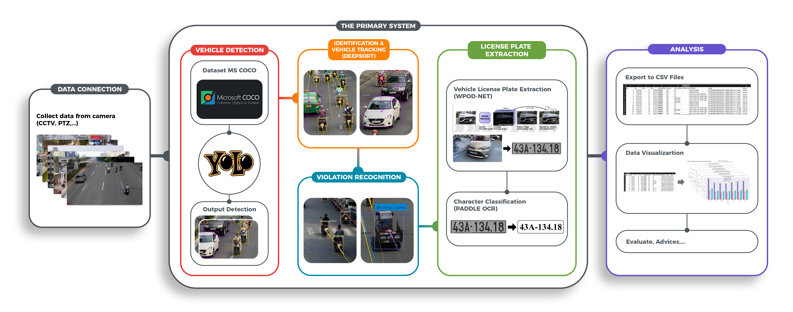
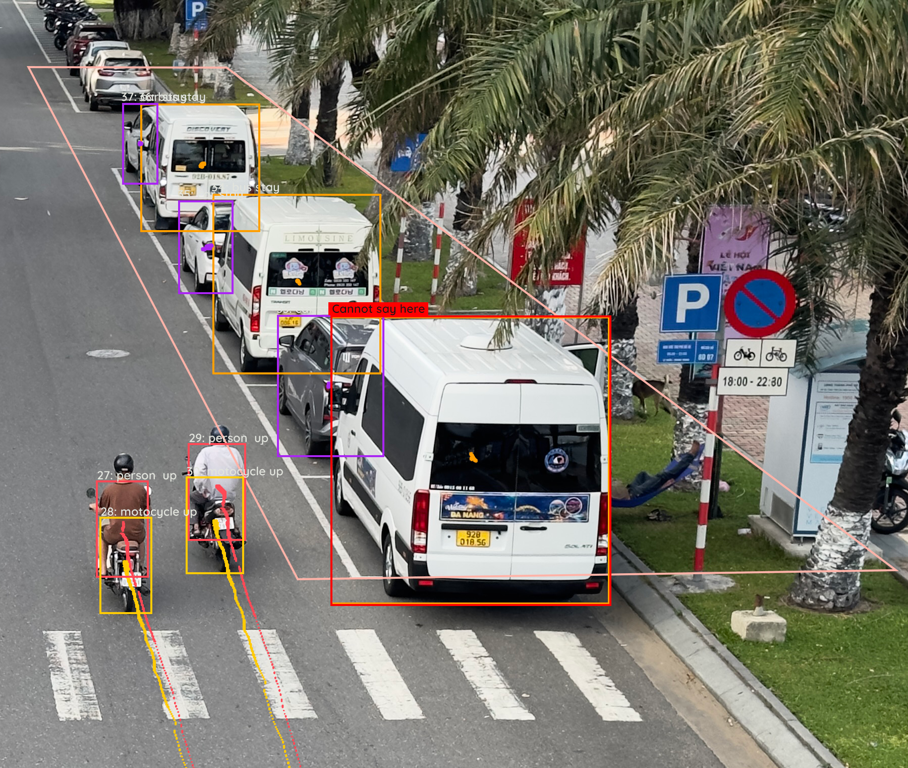
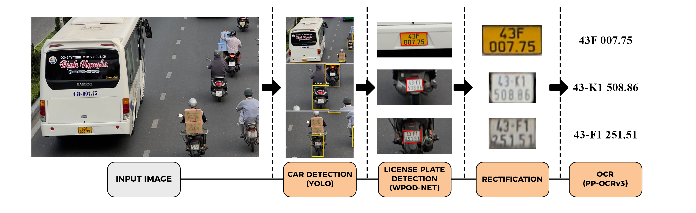

# Vietnamese Traffic System Using YOLOv9


## Getting started

Last page update: **02/09/2024**

Last version: **1.0.0** (see Release Notes for more info)

The efficiency, sustainability, and livability of urban areas are improved by smart cities, which boost economic growth and raise living standards for citizens. This makes smart cities essential to a nation's development. In the global field of smart cities, integrating intelligent transportation technologies is critical to improving urban mobility and assuring efficient traffic management. Dynamic traffic flow and management systems are the keys to these innovations, using real-time data to monitor and optimize traffic conditions. Through the application of deep learning, the purpose of this research is to create a system that can automatically identify violations. Not only does it examine the detection and analysis of traffic flow, but it also looks into the identification of instances of human behavior.  The identification of vehicles, the detection of license plates, and the classification of characters are all accomplished through the utilization of deep learning techniques like YOLO, WPOD-NET, and PaddleOCR. By employing advanced detection technologies and violation analysis mechanisms, these systems will be able to properly identify vehicles and violations across a wide range of ambient settings and weather conditions. The research was conducted and analysis in Vietnam, a country that has a big cause for concern accidents in comparison to other Southeast Asian countries. Additionally, the research suggests recognizing a variety of traffic violations, such as those that include running red lights or parking in unauthorized areas, over limitation, speed, driving in wrong lane. When applied to the daily dataset, the experiment was successful in achieving an accuracy of more than 95%.

For more information, please see:
* flowchart


* Related Github
 * https://github.com/ShreyAmbesh/Traffic-Rule-Violation-Detection-System/tree/master
 * https://github.com/sakibreza/Traffic-Rules-Violation-Detection-System


## Installation

```
deep_sort_pytorch
matplotlib
numpy
opencv-python
paddleocr
paddlepaddle
pillow
PyQt5
shapely
supervision
torch
ultralytics
wpod-net

python:3.10.13
```

* Enviroment & Source Code:
```sh
git clone https://gitlab.com/Acemitto/vietnamese-traffic-system
cd vietnamese-traffic-system
pip install -r requirements.txt
```
* Source Video:
https://drive.google.com/drive/folders/1YRJvyfyTrlYY1mtqZfVdIU6N1O1hoT6W?usp=sharing
  
* Run demo:
```
~/vietnamese-traffic-system/Source/main.py
```

## App


## Violation Detection




## License Plate Recognition & Extraction 


## Links and References:
 * [1] Jia, W., & Xie, M. (2023). An Efficient License Plate Detection Approach With Deep Convolutional Neural Networks in Unconstrained Scenarios. IEEE Access, 11, 85626–85639. 
 * [2]	Zhang, Z., & Wan, Y. (2019). Improving the Accuracy of License Plate Detection and Recognition in General Unconstrained Scenarios. 2019 IEEE Symposium Series on Computational Intelligence (SSCI) 2019
 * [3]	Silva, S. M., & Jung, C. R. (2018). License plate detection and recognition in unconstrained scenarios. In Lecture notes in computer science (pp. 593–609). 
 * [4]	Hassan, A., Ali, M., Durrani, M. N., & Tahir, M. A. (2022). Vehicle Recognition Using Multilevel Deep Learning Models. In Communications in computer and information science, pp. 101–113. 
 * [5]	Liao, M., Wan, Z., Yao, C., Chen, K., & Bai, X. (2020). Real-Time Scene Text Detection with Differentiable Binarization. Proceedings of the . . . AAAI Conference on Artificial Intelligence, 34(07), pp.11474–11481.

## Author

Stephanie Phan<br>
pthuhuongg308803@gmail.com<br>
Student at Department of Information Management<br>
National Formosa University, Huwei, Yunlin, Taiwan (R.O.C.) <br>
in Partial Fulfillment of the Requirements<br>
for the Degree of Master of Information Management<br>


Tien Tran<br>
acemitto@gmail.com<br>
Student at Software Engineering<br>
FPT University, Danang, Vietnam<br>
tientd8@fpt.com<br>
Java Full-stack Developer<br>
FPT Software, Vietnam<br>

Release Notes:
* Version 1.0.0:
First version.
