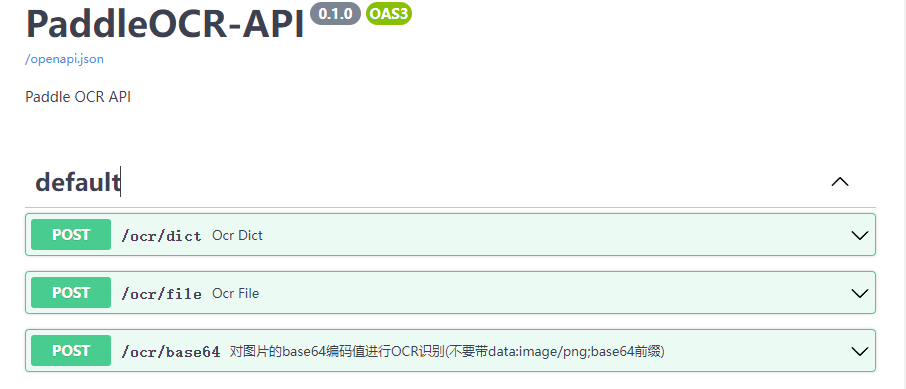

# PaddleOCR-API
<p align="center">
<p align="left">
    <a href="./LICENSE"></a>
    <a href=""></a>
    <a href=""></a>
    <a href="https://github.com/PaddlePaddle/PaddleOCR/stargazers"></a>
</p>

## Introduction

PaddleOCR-API aims to provide an out-of-the-box ocr recognition interface, the ocr algorithm comes from [PaddleOCR](https://github.com/PaddlePaddle/PaddleOCR).

## Docker Build
```shell
docker build -f Dockerfile-env.yml -t m986883511/paddleocr:env .
docker build -f Dockerfile-api.yml -t m986883511/paddleocr:api .
```

## Docker Use
```shell
docker run --rm -it -p 8000:8000 -e DET_MODEL=/build/ch_PP-OCRv3_det_infer -e REC_MODEL=/build/ch_PP-OCRv3_rec_infer --gpus all --name PaddleOCR-API m986883511/paddleocr:api
```

## Browser
When the docker run, open [localhost:8000](http://localhost:8000) you can see the interface.
<div align="center">
    
</div>


<a name="LICENSE"></a>
## 📄 License
This project is released under <a href="https://github.com/PaddlePaddle/PaddleOCR/blob/master/LICENSE">Apache 2.0 license</a>
